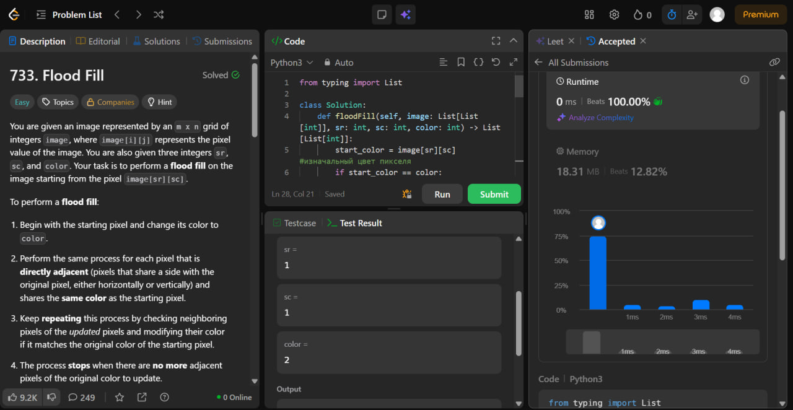
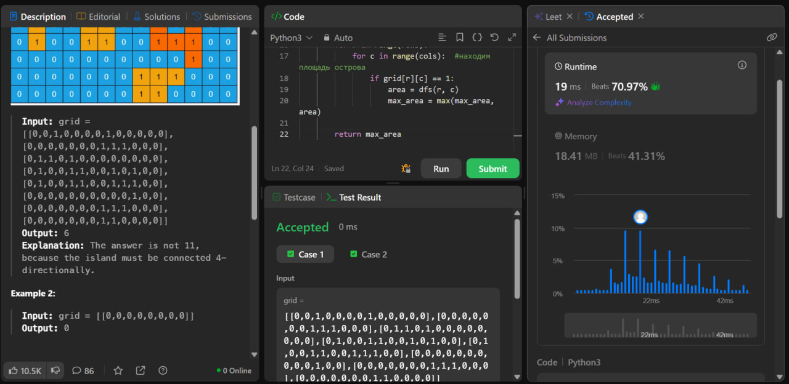
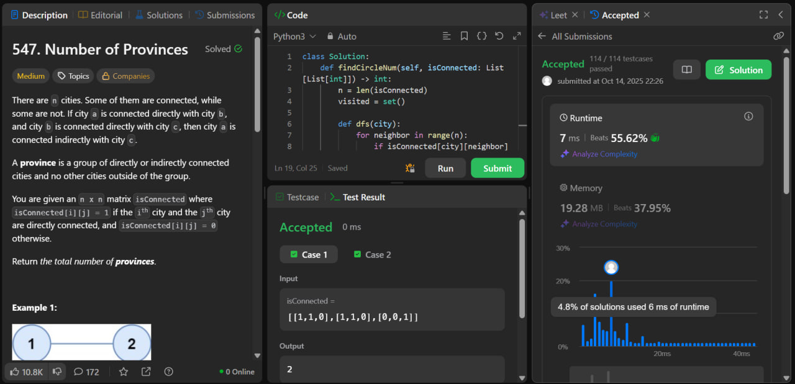

# GRAPH project

Выполнили Курбанов Давид и Ефимова Варвара

Репозиторий содержит решения задач с LeetCode, выполненных с помощью поиска в глубину (DFS).
Скриншоты условий и решений подтверждают корректную работу кода на платформе.

## Flood Fill (LeetCode #733)
**Задача:**
Закрасить область изображения, начиная с пикселя (sr, sc), в новый цвет color, распространяясь по всем соседним пикселям одного цвета (вверх, вниз, влево, вправо).

**Решение:**
Реализован DFS с проверкой границ и исходного цвета.
Если цвет совпадает с новым — возврат без изменений.

**Сложность:**
O(m × n)

## Max Area of Island (LeetCode #695)
**Задача:**
Найти максимальную площадь острова в бинарной матрице grid, где 1 — суша, 0 — вода.

**Решение:**
DFS считает площадь каждой связной области, обновляя максимум.
Посещённые клетки помечаются нулями.

**Сложность:** 
O(m × n)

## Number of Provinces(LeetCode #547)
**Задача:**
По матрице смежности isConnected определить количество провинций — связных компонент графа.

**Решение:**
Для каждого непосещённого города запускается DFS, отмечающий все связанные города.
Количество запусков = число провинций.

**Сложность:** 
O(n²)

**Полное решение представлено в блокноте notebook/Графы.ipynb**

# Longest Proper Prefix which is also Suffix

## Описание задачи
Дана строка `s`, состоящая из строчных английских букв.  
Необходимо найти **самый длинный собственный префикс** строки, который также является её суффиксом.  
Если такого префикса не существует, функция должна возвращать пустую строку `""`.

## Решение

Для эффективного поиска используется **KMP Algorithm**

### Пояснение алгоритма

1. Создаём массив `pi` длиной `n` (длина строки) и заполняем его нулями.
2. Проходим по строке с индекса `1` до `n-1`:
   - Проверяем, совпадает ли текущий символ с символом на позиции текущего возможного префикса.
   - Если совпадает, увеличиваем длину совпадающего префикса.
   - Если не совпадает, откатываемся к предыдущему возможному префиксу.
3. В конце `pi[-1]` хранит длину наибольшего префикса, который также является суффиксом.
4. Возвращаем подстроку `s[:pi[-1]]` или пустую строку, если длина равна 0.

**Решение с наивным поиском (Brute-Force)**

### Пояснение алгоритма

1. Вычисляем длину строки n.
2. Перебираем все возможные длины собственного префикса, начиная с самой длинной (n-1) до 1.
3. Для каждой длины length проверяем:
s[:length] — префикс длиной length
s[-length:] — суффикс той же длины

4. Если префикс равен суффиксу, возвращаем эту подстроку как результат.
5. Если не найдено совпадений, возвращаем пустую строку "".

### Особенности

1. Наивный метод прост и интуитивно понятен.
2. Сложность: O(n²) в худшем случае, так как для каждой длины префикса сравниваем подстроки.
3. Память: O(1) — используется только переменные для индексов и длины.
